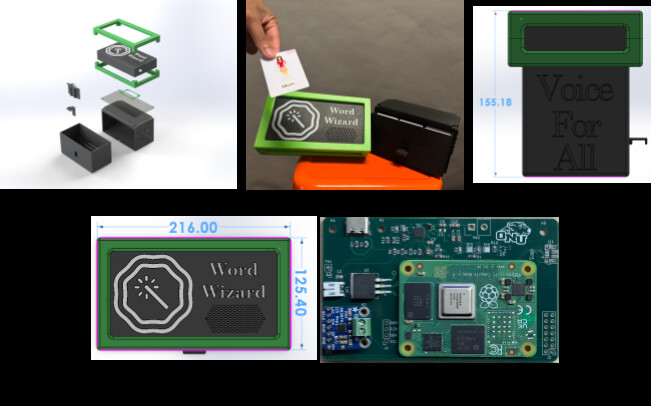
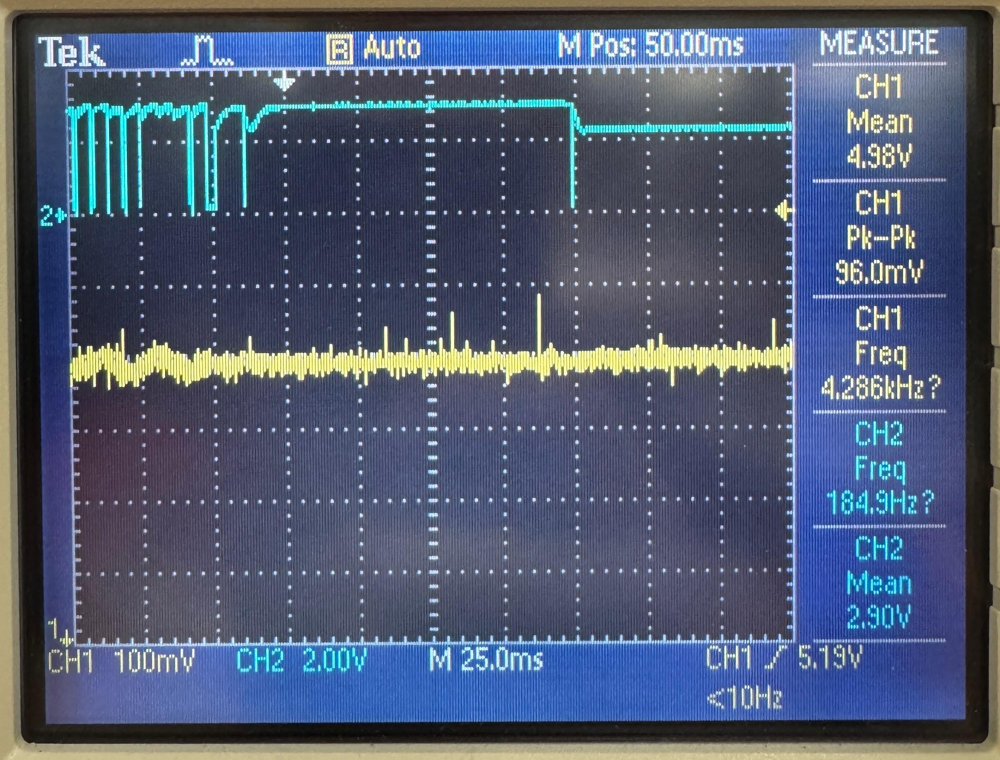
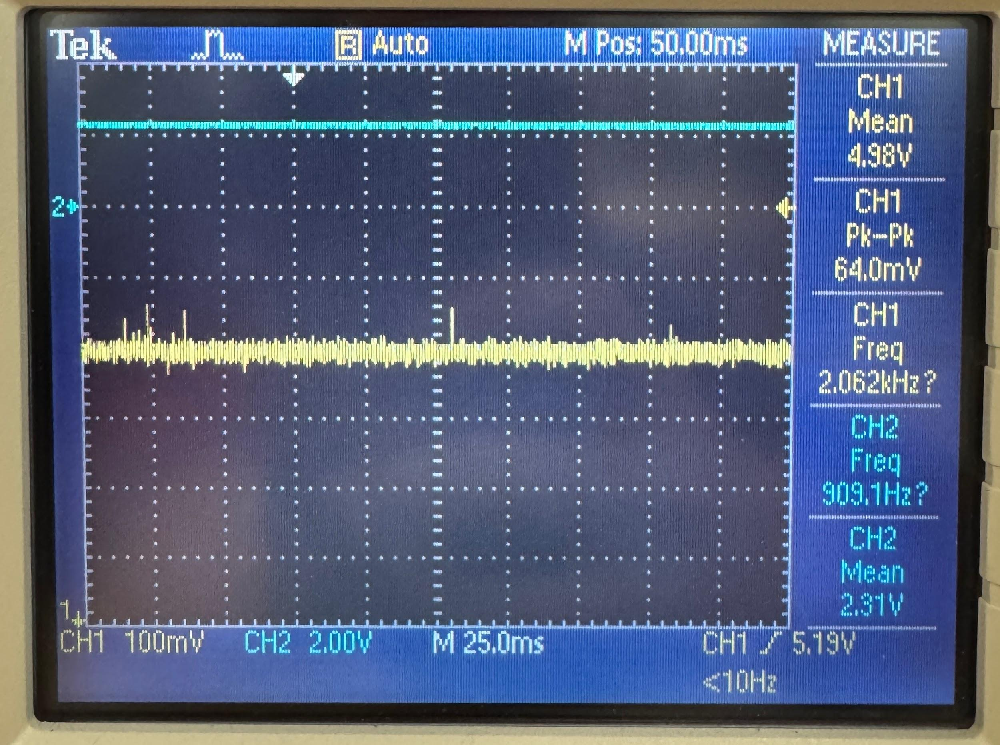
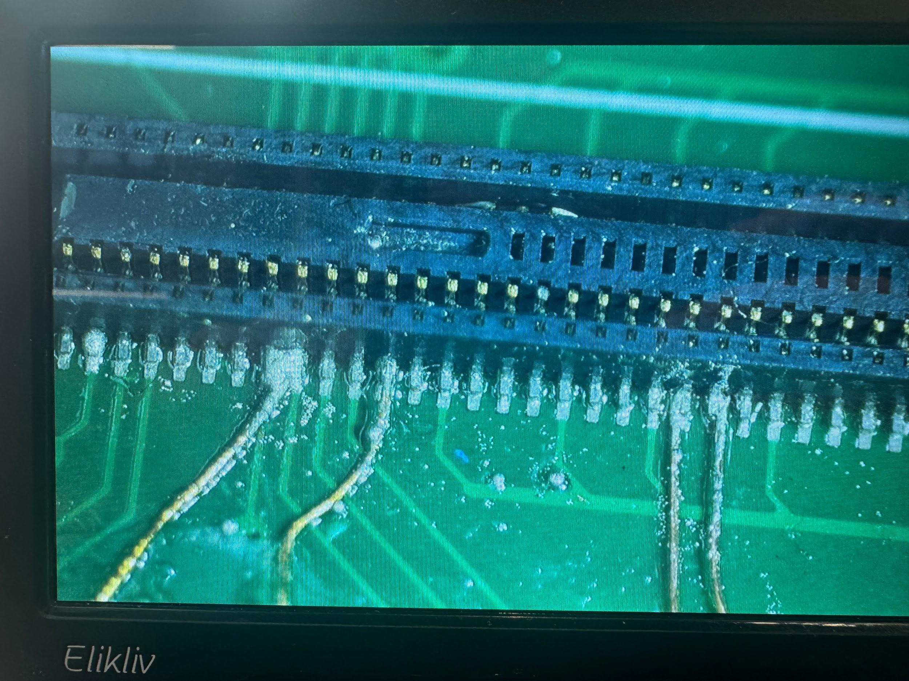

# 🪄 Word Wizard — A Voice For All

**A portable, NFC-based AAC (Augmentative and Alternative Communication) device that gives non-verbal individuals a fast, low-cost, and customizable way to communicate.**

> "Non-verbal individuals often rely on communication tools that are very limited and difficult to customize, as users often have different needs. Educators would benefit from a device that converts physical input to verbal communication that is portable and customizable."



---

## Table of Contents

- [Overview](#overview)
- [Features](#features)
- [How It Works](#how-it-works)
- [Hardware](#hardware)
- [Electronics & Firmware](#electronics--firmware)
- [Engineering Deep Dive: The PCB Fault](#engineering-deep-dive-the-pcb-fault)
- [Testing: Speaker Grille Optimization](#testing-speaker-grille-optimization)
- [Bill of Materials](#bill-of-materials)
- [Repo Structure](#repo-structure)
- [Design Documentation](#design-documentation)
- [Future Work](#future-work)
- [Broader Impacts](#broader-impacts)
- [Team](#team)
- [Acknowledgments](#acknowledgments)

---

## Overview

Word Wizard is a semester-long engineering capstone project built to give non-verbal students, educators, and caregivers a simple, durable, and affordable alternative to expensive tablet-based AAC systems. A user taps a color-coded NFC communication card on the device, and Word Wizard speaks the corresponding word or phrase aloud through an onboard text-to-speech (TTS) engine.

The device is built around a **Raspberry Pi Compute Module 4** on a custom-designed PCB, an **NFC reader** for card input, a **Piper TTS engine** for multilingual speech output, and a fully 3D-printed enclosure with an integrated card storage drawer.

## Features

- 🔖 **NFC-based input** — tap a card, hear a word. No menus, no screens, no complex UI.
- 🎨 **Fitzgerald Key color coding** — cards are grouped by grammatical category (questions, actions, social words, people) using a widely recognized AAC standard.
- 🗣️ **Multilingual TTS** — powered by the [Piper](https://github.com/rhasspy/piper) TTS engine, supporting multiple languages and dialects.
- 🔋 **USB-C rechargeable** — ≥30 Wh battery, no proprietary cables or disposable batteries.
- 🧰 **Fully customizable vocabulary** — any NFC-writable smartphone can reprogram a card in seconds.
- 🛡️ **Durable, drop-tested enclosure** — TPU bumper rated for drops from ~3 ft onto hard flooring.
- 🗄️ **Integrated card storage** — drawer system holds 40+ color-coded cards.
- 💰 **Low-cost alternative** — significantly cheaper than tablet-based AAC solutions, and scalable for classroom/bulk deployment.

## How It Works

1. A teacher or parent programs an NFC card with a word or phrase using any NFC-write-capable smartphone.
2. The user taps the card on the device's NFC reader (marked by the wand logo).
3. A PN532 NFC reader (I2C) on the custom PCB reads the NDEF text record off the card.
4. The Raspberry Pi Compute Module 4 parses the NFC payload and passes it to the Piper TTS engine.
5. Audio is output through a Class-D mono amplifier and speaker, tuned to 60–65 dB (normal speech volume).

## Hardware

| Spec | Detail |
|---|---|
| Compute | Raspberry Pi Compute Module 4 |
| Input | PN532 NFC reader (I2C) |
| Audio | MAX98357A Class-D I2S amplifier + speaker |
| Power | 2S Li-Ion pack, BQ25886 charge management, USB-C input |
| Enclosure | PLA (case, drawer), TPU (bumper, gasket), cast acrylic (lid) |
| Manufacturing | FDM 3D printing (BambuLab A1) |
| Dimensions | 216.0 × 125.4 × 162.2 mm |
| Total weight | ~951 g |
| Battery life | ≥30 Wh |

The enclosure was fully modeled in SolidWorks — see [`design/`](design/) for CAD drawings of the case, drawer/slider assembly, and TPU bumpers, including standoffs for the PCB, speaker grille, charging port, switch port, and NFC reader slot.

## Electronics & Firmware

The custom PCB (`Word Wizard PCB`, designed in KiCad) integrates:

- **CM4 IO Board** — carrier board for the Compute Module 4
- **Power Management** — BQ25886 Li-Ion charger, 5V/5A LDO regulation, power-good and charge-status LEDs, USB-C PD-only input
- **High-Speed I/O** — USB OTG (micro-USB, for CM4 programming) with ESD protection
- **GPIO / DAC** — I2C to the PN532 NFC reader, PCM5122 I2S DAC feeding a MAX98357A audio amplifier

Firmware (C, see [`firmware/`](firmware/)) reads NDEF Text records off NTAG21x cards over I2C using [`pn532-lib`](https://github.com/soonuse/pn532-lib), parses the TLV/NDEF structure, and forwards the decoded text to the TTS pipeline.

```
Wiring (I2C, default):
  PN532 SDA -> RPi GPIO 2 (Pin 3)
  PN532 SCL -> RPi GPIO 3 (Pin 5)
  PN532 VCC -> 3.3V or 5V
  PN532 GND -> GND
```

## Engineering Deep Dive: The PCB Fault

One of the most time-consuming parts of the project was tracking down an intermittent fault on the custom PCB. Code and hardware that worked fine on a jumper-wired development board began failing after being transferred to the custom board — the device would boot normally, then enter a boot loop roughly 20–30 seconds after a card was read.

**Diagnosis process:**

1. Ruled out power-supply issues by isolating each board on its own supply.
2. Put the PN532's I2C bus on an oscilloscope. The data line topped out at 3.1V instead of a full 3.3V logic high.

    

3. After ~20–30 seconds, the data line collapsed to 2.31V — indicating the board was hitting a thermal fail-safe and powering itself down.

    

4. Root cause: the CM4's **GPIO_VREF** pin — which must be hard-tied to 1.8V or 3.3V to set GPIO logic level — had been left floating on the custom board, settling at ~2.3V. External 3.3V pull-up resistors (added for the PN532) were fighting that incorrect reference, creating an extra thermal load that eventually tripped the CM4's thermal protection.
5. **Fix:** manually rewired GPIO_VREF directly to 3.3V using 39 AWG wire under a microscope — a delicate hand-soldering job on a Hirose board-to-board connector.

    

6. Verified the fix back on the oscilloscope: clean rising/falling edges on both I2C lines, comfortably past the logic thresholds.

This was the single biggest lesson of the build: **one unconnected reference pin caused hours of debugging** — a reminder of how much value there is in double-checking datasheets and having a second set of eyes on a schematic before fabrication.

## Testing: Speaker Grille Optimization

To find the best trade-off between sound clarity and dust/debris resistance, the team 3D-printed six speaker grilles with hole diameters from 1.5mm to 4.0mm and measured sound pressure level (dB) at a fixed distance for three test phrases ("Why," "Please," "Stop").


**Result:** the **2.5mm hole diameter** produced the best average sound output (71.7 dB vs. 68.5 dB uncovered) while still offering meaningfully better debris resistance than larger holes. Full raw data and the test protocol are in [`testing/decibel-test-results.md`](testing/decibel-test-results.md).

## Bill of Materials

Full sourced BOM with vendor links and pricing is in [`bom/budget-tracker.md`](bom/budget-tracker.md). Total project spend: **~$205** (largely CM4/board, NFC reader, speaker, amp, and passives).

## Repo Structure

```
word-wizard/
├── README.md
├── firmware/            # NFC read + NDEF parsing (C)
├── hardware/            # KiCad schematics/PCB, connector notes
├── design/              # SolidWorks/CAD drawings, drawer & bumper parts
├── testing/             # Speaker grille dB test protocol + raw results
├── bom/                 # Sourced bill of materials
├── docs/                # Educator user manual, problem framing, broader impacts
└── assets/              # Photos and diagrams used in this README
```

> **Note:** this repo currently hosts the project write-up, CAD reference drawings, firmware, and PCB schematics consolidated from the team's final report. If you're setting this up as a fresh GitHub repo, drop your actual `.kicad_pro`/`.kicad_sch`, `.SLDPRT`/`.SLDASM`, and source files into the folders above alongside this README.

## Design Documentation

- [Educator Reference Manual](docs/user-manual.md) — setup, daily operation, charging, cleaning, troubleshooting
- [Problem Framing](docs/problem-framing.md) — stakeholders, research questions, assumptions, evaluation metrics
- [Broader Impacts](docs/broader-impacts.md) — People / Planet / Profit analysis with tradeoffs

## Future Work

- Move card access from a bottom drawer to a top-loading slot to reduce operating complexity for the primary user
- Merge the device and card-storage system into a single piece for easier management by teachers/parents
- Injection-molded silicone bumper (removable, phone-case style) instead of 3D-printed TPU, for easier cleaning and to escape FDM print constraints
- Switch the audio path from I2S to **SPI** to improve software/response speed
- Consolidate the electronics footprint to reduce overall device size and material use
- Standardize on common screws for all hardware to improve end-of-life disassembly and recyclability (balanced against tamper risk)

## Broader Impacts

| Category | Benefits | Risks / Tradeoffs |
|---|---|---|
| **People** | Shock-absorbent TPU bumper, USB-C (no proprietary cables), low-cognitive-load NFC tap input | Accessible screws are also a tamper/safety risk for young users; drawer adds a second part to manage |
| **Global/Cultural** | Fitzgerald Key is a recognized AAC standard; Piper TTS supports multiple languages/dialects | Color coding may not translate across cultures; NFC programming requires a smartphone |
| **Planet** | No laminate/print waste from reprogramming; modular hardware extends device life; rechargeable battery; recyclable ABS/TPU | PCB components are non-biodegradable; current manufacturing is energy-intensive |
| **Profit** | Lower cost than tablet AAC alternatives; scalable/modular for schools; costs drop with bulk orders | Long device lifespan reduces repeat business; SPI migration would add R&D cost |

Full stakeholder analysis and research log in [`docs/problem-framing.md`](docs/problem-framing.md).

## Team

Built by **Team 5**, Ohio Northern University — Foundations of Design II, 2026.

| Name | Focus Areas |
|---|---|
| Ethan D'Souza | Documentation, testing, broader impacts, electronics selection |
| Logan Frazer | CAD, NFC card programming, drawing annotation |
| Aiden McManis | Poster, scheduling/Gantt, presentation, drawer/slider design |
| Owen Willoby | Poster design, budget tracking, troubleshooting |
| Jeremiah Koenig | Final assembly, PCB population, presentation |
| Collin Snider | PCB design, diagnosis & rework, wiring/assembly |

## Acknowledgments

- Christina Teevan, Executive Director, Ashland Special Needs Ministry — early-stage user research
- Ohio Northern University Foundations of Design II course staff
- AI tools (Claude, Gemini, ChatGPT, GPAI) were used for problem framing, text refinement, and firmware assistance — see [`docs/ai-disclosure.md`](docs/ai-disclosure.md)

## License

Released under the [MIT License](LICENSE) — feel free to fork, build on, or adapt this project. Swap in a different license if your team/school has different preferences.

---

*Originally submitted as a final capstone report. Ported to GitHub as a project reference and portfolio piece.*
