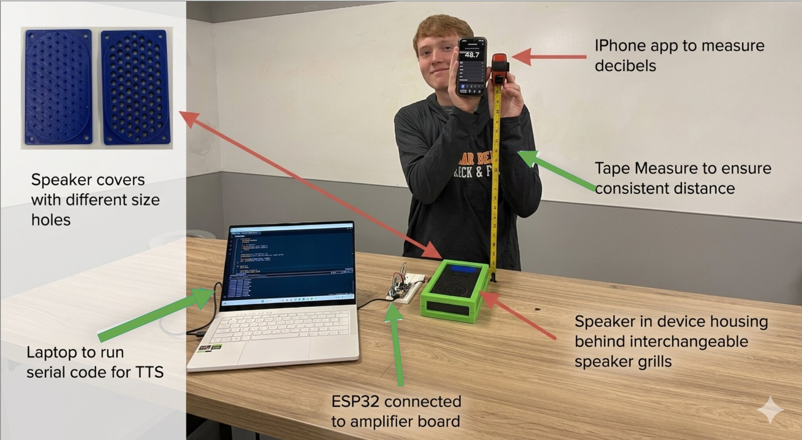

# Appendix 2: Test Results

**Test Title:** Decibel Output Testing for Variable Speaker Holes

**Purpose:** To determine the best speaker cover to ensure optimal sound clarity and quality, as determined by decibel levels.

## Equipment

- Speaker
- Microcontroller
- Amplifier
- Speaker covers (6 covers)
- Sound level meter
- Tape measure
- Means to record data

## Variables

**Independent:** Speaker hole size
**Control:** Distance between reader and speaker, speaker volume, speaker, material of cover, same word tested
**Dependent:** Sound output level (dB)
**Uncontrollable:** Cleanliness of speaker holes, accuracy of measurement tools

## Experimental Setup

Speaker covers were 3D-printed with varying hole diameters (1.5mm, 2.0mm, 2.5mm, 3.0mm, 3.5mm, 4.0mm). A sound level reader was held at ear level, at a fixed distance (measured with a tape measure) from the speaker, which was oriented toward the reader.

## Procedure

1. Gather all materials.
2. Place materials on a table that is cleared and ready for the test.
3. Hook up the speaker to the amplifier + microcontroller apparatus.
4. Cover speaker with speaker cover.
5. Hold sound level reader at ear level (speaker oriented toward reader, still on the table).
6. Use the sound level reader to collect data from the speaker output.
7. Output a text-to-speech word from the speaker.
8. Repeat steps 4–6, changing/adding the speaker cover for each hole diameter.
9. Record results in the data table.
10. Record any observations.

## Quantitative Results

Raw dB readings per test phrase, per hole diameter:

| Phrase | Control (no cover) | 1.5mm | 2.0mm | 2.5mm | 3.0mm | 3.5mm | 4.0mm |
|---|---|---|---|---|---|---|---|
| "Why" | 66.5 | 72.4 | 75.6 | 76.5 | 76.3 | 63.7 | 68.8 |
| "Please" | 70.4 | 64.3 | 65.8 | 65.7 | 68.5 | 70.3 | 72.6 |
| "Stop" | 68.6 | 58.0 | 59.4 | 72.9 | 57.3 | 75.6 | 63.1 |
| **Average** | **68.5** | **64.9** | **66.9** | **71.7** | **67.4** | **69.9** | **68.2** |

## Observations

After conducting the experiment, the team found the **2.5mm diameter speaker grille** gave the best average sound output. It also did better at keeping out dust and debris than its larger counterparts. Smaller diameters had too much sound loss to justify their improved debris resistance — so 2.5mm was selected as the best overall balance between clarity and durability.

**Conducted by:** Ethan D'souza, Owen Willoby, Jeremiah Koenig, Aiden McManis
**Date tested:** 4/9/26
